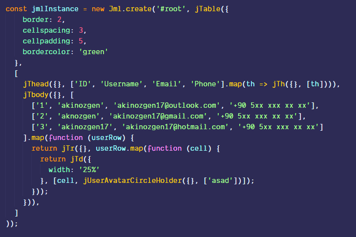
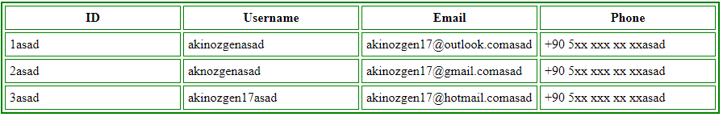

> Notice: I did some updates and documentation is not capable enough to explain all capabilities. Best way to understand is digging around examples which is at the below of this documentation.


<div align="center">
<h1>JaMaL</h1>
 <a href="https://badge.fury.io/js/jamal" rel="nofollow" class="rich-diff-level-one"></a>
<p>Stupidly simple javascript view engine</p>

 
<a href="https://nodei.co/npm/jamal/" rel="nofollow"></a>

</div>

JaMaL stands for JML which is javascript markup language. "a"'s are just filling.

> Jamal (Arabic: جمال‎ Jamāl/Ǧamāl ) is an Arabic masculine given name, meaning "beauty". The use of this name is widespread across the Muslim world. In Egypt the name is pronounced [ɡæˈmæːl] and so is normally spelled Gamal . Tunisians may spell it Jamel. [Source](https://en.wikipedia.org/wiki/Jamal)


## Table Of Contents
* [Philosophy](#philosophy)
  * [Why "JaMaL"?](#why-jamal)
  * [What is it for?](#what-is-it-for)
  * [Whom is it for?](#whom-is-it-for)
* [Basic Usage](#basic-usage)
    * [JMLInstance](#jmlinstance)
    * [jSomething functions](#jsomething-functions)
    * [Accessing refs.](#accessing-refs)
    * [Nesting](#nesting)
    * [Callbacks](#callbacks)
* [Get Started](#get-started)
    * [CDN](#cdn)
    * [NPM Package](#npm-package)
    * [Development](#development)
    * [Examples](#examples)
* [To-do](#to-do)
* Advanced Usage
  * Comng Soon     

------

### Philosophy

JaMaL is for creating html content with javascript functions. A "J" function takes three arguments which are attributes, children and debug config. Just this. No need to know fancy observers, reducers or something like that. 

#### Why "JaMaL"?

Obviously i'm not arab or arab fan or things like that. I made a library called `jml.js` which stands for `javascript markup language`. I wanted to remake of that library and didn't wanted to find a new name. But `jml` and `jml.js` already picked on npm so i needed to little changes and thats where `JaMaL` came from. I just filled gaps with `a`'s. After that i needed a new logo with that middle eastern name so i used [Launchaco Logo Maker](http://launchaco.com/logo) to make a logo that makes sense with new name.

```
Logo Credits:
font name: amita-regular
font link: https://fonts.google.com/specimen/Amita
font author: Eduardo Tunni
font author site: http://www.tipo.net.ar/

icon designer: Brittnee Snodgrass
icon designer link: /brittnee.snodgrass
```

#### What is it for?

Simply; creating dom nodes with programmatic way. 
Complex way: There soo many javascript frameworks hanging around and i wanted to make a protest to this community. You don't need a framework for every thing, just use jQuery or write yourself.

Simply; you have an ajax call and this call appends new content to your DOM. Don't write html yourself, just use a jml tag function to render content.

[☮ Respects to Vanilla.js 💚💜💝](http://vanilla-js.com/)

### Whom is it for?

Of course this is not for huge projects. It was just a hobby to me so i hope same for you to.

### Basic Usage

I'm don't know how to describe its lifecycle in english. I'm not best at it. But i think it explains itself:

```html
<div id="root"></div>
<script src="./jml.min.js"></script>
<script>
    Jml.initialize({
        customTags: ['theme', 'example', 'akinozgen', 'profile-image', 'user-avatar']
    });

    const jmlInstance = new Jml.create('#root', jDiv({ class: 'container blog-post' }, [
        jArticle({ class: 'article-body' }, [
            jImg({ src: 'http://placehold.it/200x200' }, []),
            jP({ style: 'margin-bottom: 10px' }, ['lorem....']),
            jA({ href: '#', target: '_blank' }, ['Click Me!'])
        ])
    ]));

    jmlInstance.render();
</script>
```

#### JMLInstance

JMLInstance returns an object that has five elements. They are:
* `body`: dom element that selected by given selector.
* `render`: render method renders markup to `body`
* `clear`: truncates `body`
* `getRef`: returns dom element by provided `_id`. `_id` is randomly created by jml.
* `markup`: created dom content. 


#### jSomething functions

jSomething functions are totally html tags can be used as functions.
For example html has `article` tag, jml has `jArticle` tag. Also jSomething tags can be created by given custom tags in `jmlInstance.initialize` method.

jSomething methods also has config options. Currently it has just two options, `debug` and `inspect`.
Debug option gives information about jSomething function runtime, inspect options puts debugger in that jSomething method.

#### Accessing refs

Your `jmlInstance` object has property called `getRef`. Which is a function, takes string for `_id` attribute.
This method returns a reference from actual dom tree so you can easily inspect your actual dom.

Usage:
```javascript
    jmlInstance.getRef('_c0dq6bv4v');
    // output
    // <th _id="_c0dq6bv4v">Username</th>
```

#### Nesting

Everything is jSomething method, a jSomething method takes an argument which can be another jSomething method. So you need to understand nesting carefuly. Also all jSomething methods returns an `HTMLElement` object

There is some complex example:



And thats actual render:



jSomething functions overloads (ex. jTable)
```typescript
jTable(): HTMLElement;
jTable(children: string|HTMLElement): HTMLElement;
jTable(children: Array<string|HTMLElement>): HTMLElement;
jTable(attributes: Object<string, string|number|function>, children: string|HTMLElement): HTMLElement;
jTable(attributes: Object<string, string|number|function>, children: Array<string|HTMLElement>): HTMLElement;
```

#### Callbacks

A jSomething functions second args (which is an array) can be mapped with `.map`, `.filter` or functions like that. One obligation: it must be an array after all.


### Get Started

Clone project to you local machine. Install dependencies with `npm install` or `yarn` command. 

#### CDN
```html
<script src="https://unpkg.com/jamal@latest/build/src.min.js"></script>
```

#### NPM Package
[JaMaL on NPM](https://www.npmjs.com/package/jamal)
```bash
$ npm install jamal
```

#### Development

Run `yarn watch` command and open http://localhost:8080 from your browser and get started. No not modify `src/index.js` unless you know what you're doing. `src/index.js` file is main jml library file. If you want to use jml (not developing it) import another script or write it inside html file.

#### Examples

| [Bootstrap 4 Boilerplate](/src/bootstrap-example.html)                                                                         | Promise API Call                                                                                                  | [Components Example](https://github.com/jamaljs/example-components)                                                       | [Character Counter](https://gist.github.com/akinozgen/4aabadd0ec08142b8ce75e2b80e27b48)                                  |
|--------------------------------------------------------------------------------------------------------------------------------|-------------------------------------------------------------------------------------------------------------------|---------------------------------------------------------------------------------------------------------------------------|--------------------------------------------------------------------------------------------------------------------------|
| [](https://codesandbox.io/s/p2wjp9w6jx) | [](https://codesandbox.io/s/y7qj526o21) | [](https://codesandbox.io/s/48mo84xvlx) | [](https://codesandbox.io/s/k35w32v1zv) |

-----------
| 1.2.0 Updates                                                 |
|---------------------------------------------------------------|
| [See On Codepen](https://codepen.io/akinozgen/pen/rPeGQv) |

### To-Do

- [x] onEvents for jSomething methods.
- [x] NPM package update.
- [x] Remove customTag necessity.
- [x] More flexible parameter passing for jSomething functions. 
- [x] Promise based async children ~~and parameters~~ support.
- [ ] Two way binding for children.
- [ ] HTML to JML tool. 
